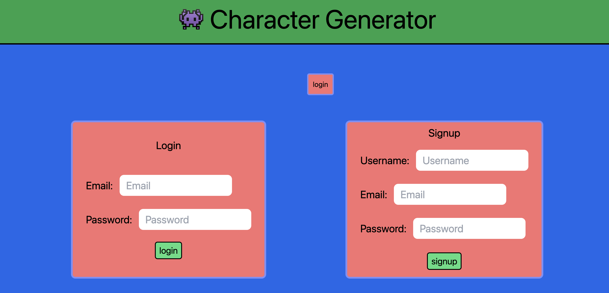
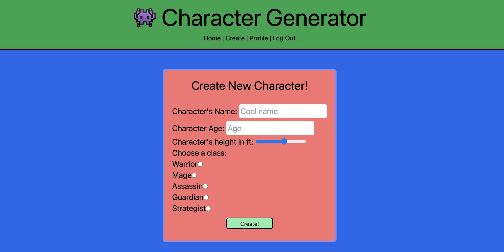
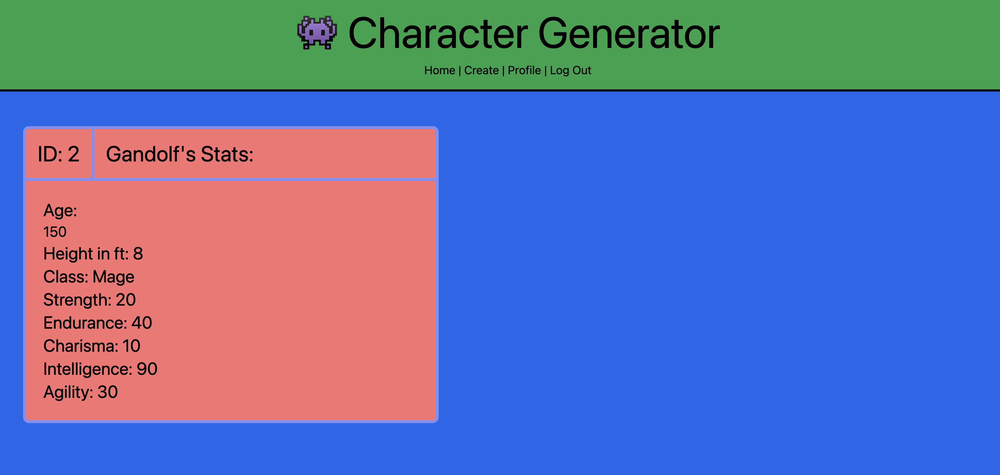
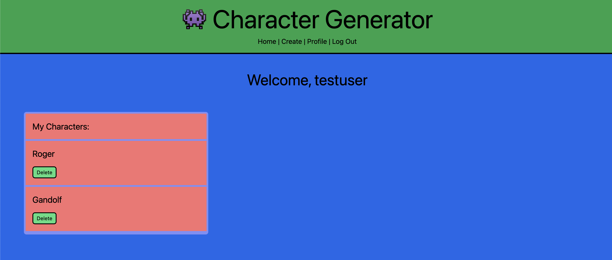

# Characterize This!

An interactive full-stack application built in collaboration using the MVC model

## Description

- The concept for this project is a character database to create and store a user’s character sheets and statistics. Characters are able to be assigned one out of several different classes within the database which, in turn, give them their own individual skill statistics.
- Our group was inspired to create this application by popular role-playing games such as Dungeons and Dragons and the Fallout series, where the traits and skills of one’s character are heavily influential on gameplay.
- The intended users for our application are (primarily) people who participate in these games, however, its functionality is also applicable to people who enjoy creating stories within any medium, such as books, movies, and television series.

## Table of Contents

- [Built Using](#built-using)
- [Deployed Application](#deployed-application)
- [Installation](#installation)
- [Usage](#usage)
- [Screenshots](#screenshots)
- [Credits](#credits)
- [License](#license)
- [Contributions](#contributions)

## Built Using

          

## Deployed Application

- https://characterize-this.herokuapp.com/

## Installation

- This project can be tested locally by cloning or forking the repo. You will want to make sure Node.js (https://nodejs.org/en/) has been installed on your device.
- Once the repo is cloned locally, inside the `package.json` file, you will see the list of required dependencies used throughout this project.
- To install the dependencies, enter `"npm install"`
- Once installed, you can run `"npm run start"` to start the server and begin!

## Usage

- Upon viewing the page, the user will be prompted to either login (if they have an existing account), or sign up and create a new user with a username, email address, and password.
- If logged in, the user will be redirected to their profile page, where a corresponding list of their created characters will be displayed.
- Each created character in the profile can be viewed, prompting another reroute for the user to view the class statistics for the specific user.
- If you are a new user, or would like to create a new character, simply select the "Create" button where you will be taken to the character creation form and prompted to create a character with name, age, height, and a desired class. Each class has pre-determined stat points, so those features are taken care of for you.
- Once you are done, you can continue the character creation process and add more to your profile, or simply exit and logout of the site.

## Screenshots

1. Home Screen & Login
   

2. Character Creation Form
   

3. Character Details Page
   

4. Profile View / List of Characters
   

## Credits

- Adam Santillana
  - https://github.com/Adam42288
- Brigita Biederman
  - https://github.com/bravenbright
- Carlos Bautista
  - https://github.com/CxLos
- Mark Barstow
  - https://github.com/marchetype
- Sam O'Cain
  - https://github.com/samocain93
- Additional assistance led by Jason Vissage (TA) and Torre Taylor (Instructor)

## License

## Contributions

- This project is not currently accepting contributions, however it can be cloned and tested locally or by forking the repository.
