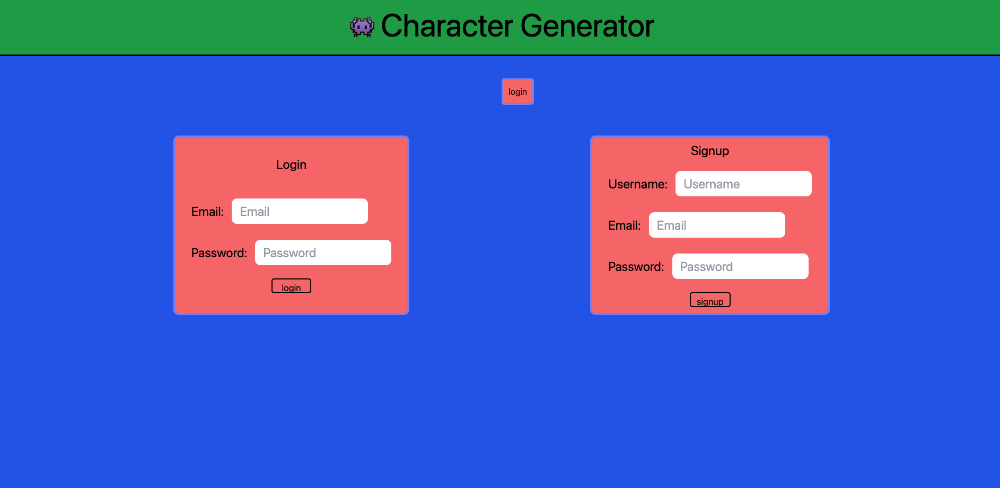

# Character Generator

An interactive full-stack application built in collaboration using the MVC model

## Description

- Fantasy and roleplaying games are beloved by millions all over the world. Whether as a tabletop game, on a computer, or playing on a console online with friends, these types of games embody a huge community of devoted followers. Our goal was to help create an application that allowed users to create, store and view characters that they can use within their roleplaying game. With our site, users will have the opportunity to create a login, create new characters, assign them to a class, and be able to view them within their profile for use at any time.

## Table of Contents

- [Built Using](#built-using)
- [Deployed Application](#deployed-application)
- [Installation](#installation)
- [Usage](#usage)
- [Screenshots](#screenshots)
- [Credits](#credits)
- [License](#license)
- [Contributions](#contributions)

## Built Using

          

## Deployed Application

- !!! HEROKU LINK HERE

## Installation

- This project can be tested locally by cloning or forking the repo. You will want to make sure Node.js (https://nodejs.org/en/) has been installed on your device.
- Once the repo is cloned locally, inside the `package.json` file, you will see the list of required dependencies used throughout this project.
- To install the dependencies, enter `"npm install"`
- Once installed, you can run `npm run start` to start the server and begin!

## Usage

## Screenshots

## Credits

- Adam Santillana
  - https://github.com/Adam42288
- Brigita Biederman
  - https://github.com/bravenbright
- Carlos Bautista
  - https://github.com/CxLos
- Mark Barstow
  - https://github.com/marchetype
- Sam O'Cain
  - https://github.com/samocain93
- With assistance led by Jason Vissage (TA) and Torre Taylor (Instructor)

## License

## Contributions

- This project is not currently accepting contributions, however it can be cloned and tested locally by forking the repository.
